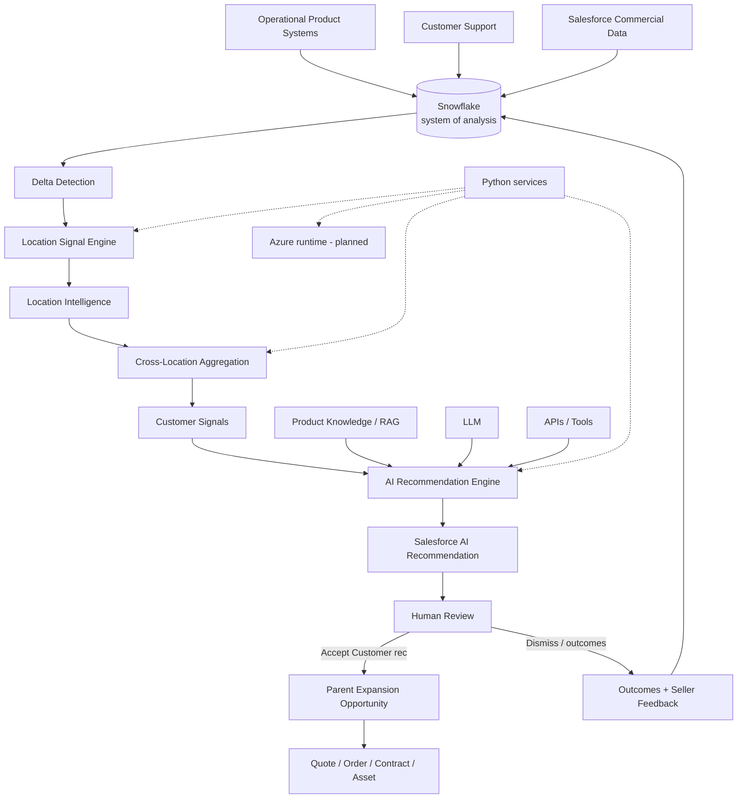

# GTM Expansion Intelligence

This project explores how a vertical SaaS company can identify better post-sales expansion opportunities across its existing customer base by combining product usage, support activity, contract context, and CRM data.

**A seller shouldn’t have to open five systems and manually study hundreds of accounts to figure out who needs help next.**

Product usage knows how the customer is behaving.  
Support knows where the customer is struggling.  
CRM knows what they own.  
Contracts know where they are commercially.

And there is another complication: one “customer” may actually be 20 operating locations behaving very differently.

A parent account can look healthy while one branch is struggling. One noisy branch can also make the entire business look unhealthy if the data is flattened too early.

This project explores a different approach:

Preserve the evidence at the location level.  
Derive reliable signals with deterministic logic.  
Aggregate them at the right business level.  
Then use AI where it adds value — understanding context, forming a hypothesis, and helping the seller decide what to do next.

`Raw evidence → location signals → business intelligence → AI reasoning → human decision → GTM action`

**The model can form a hypothesis. It cannot invent the evidence.**

---

## Why I built this

I work on GTM systems, and one pattern I keep seeing is that CRM contains only part of the customer story.

The interesting signals often live elsewhere — product telemetry, support systems, operational data, and the data warehouse.

I wanted to explore a practical question:

How can we make those signals useful to sellers without turning the LLM into the source of truth?

---

## One Customer Is Not Always One Operating Unit

A multi-location customer should not be analyzed as if all branches behave identically.

This system evaluates evidence at the location level first.

Then it determines whether the pattern is:

- isolated,
- multi-location,
- business-wide.

Location recommendations preserve operational evidence.

Customer recommendations drive commercial action.

**Preserve local evidence. Make commercial decisions at the right business level.**

---

## Concrete example: Acme Home Services

**Customer:** Acme Home Services  
**Locations:** 12

| Location | What we observe |
|----------|-----------------|
| Houston | Inbound leads +35%, response time worsening, conversion declining, Contact Center not enabled |
| San Antonio | Similar pattern |
| Austin | Stable |
| Dallas | Contact Center already active |

**Location insight:** Houston and San Antonio show sustained inbound-demand pressure.

**Customer insight:** The pattern affects multiple meaningful locations and appears systemic rather than isolated.

**Recommendation (planned):** Evaluate phased Contact Center expansion.

**Scope:** `MULTI_LOCATION`

**Suggested initial locations:** Houston, San Antonio

**Commercial action:** One parent-level Expansion Opportunity — only after human acceptance.

---

## What the system does

Eventually, the daily batch will:

1. Detect changed customers / locations
2. Derive deterministic location signals
3. Stop when nothing meaningful changed
4. Generate location intelligence
5. Aggregate signals across locations
6. Determine customer-level significance
7. Retrieve relevant product knowledge
8. Generate a grounded customer recommendation
9. Sync to Salesforce as a Draft recommendation
10. Keep human approval before commercial action
11. Capture outcomes for measurement

Architecture deliberately separates:

```text
RAW FACTS
→ DETERMINISTIC SIGNALS
→ HIERARCHY-AWARE AGGREGATION
→ AI REASONING
→ HUMAN DECISION
→ COMMERCIAL ACTION
```

This is **not** “send a large account JSON payload to an LLM and ask it what to sell.”

---

## Architecture



Snowflake is the system of analysis. Salesforce is the system of action. Python owns signals, aggregation, and orchestration. AI interprets verified signals. Azure is the planned production runtime — same code, containerized later.

---

## Why deterministic signals before AI

Facts should not depend on model creativity.

Python calculates:

- changes and thresholds,
- product gaps,
- support patterns,
- contract timing,
- location coverage,
- weighted aggregation,
- trend duration.

The LLM interprets those verified signals, retrieves product knowledge, forms a hypothesis, and helps the seller decide what to do next.

**The model can form a hypothesis. It cannot invent the evidence.**

---

## Snowflake vs Salesforce

| System | Role |
|--------|------|
| **Snowflake** | System of analysis — telemetry, support facts, hierarchy, analytical entitlement snapshots, outcomes, pipeline state |
| **Salesforce** | System of action — Account hierarchy, Opportunities, Quotes, Orders, Contracts, Assets, AI recommendations for review |

High-volume telemetry and historical activity do not belong in CRM.

Actionable intelligence does.

Commercial data may be replicated analytically into Snowflake while Salesforce remains authoritative.

---

## Human in the loop

AI proposes. The seller evaluates.

The seller accepts or dismisses.

An accepted **Customer**-level recommendation may create a parent Expansion Opportunity.

Location recommendations support the reasoning but do not create Opportunities directly.

Dismissal becomes structured feedback (wrong product, bad timing, incorrect evidence, already in progress, not eligible, not relevant, other).

---

## Batch pipeline

```text
Changed source data?
  No  → exit
  Yes → calculate signals

Signal state materially changed?
  No  → exit
  Yes → AI recommendation → validate → Salesforce sync → persist state
```

`No meaningful change → no LLM call → no seller noise.`

The pipeline is designed to be idempotent and stop early.

---

## Recommendation output (planned)

Until implemented, treat this as a contract sketch — not a live API:

- recommended product
- recommendation scope (`LOCATION` | `CUSTOMER`)
- rollout scope (`SINGLE_LOCATION` | `MULTI_LOCATION` | `BUSINESS_WIDE` | `NO_ACTION`)
- confidence
- affected locations
- evidence
- hypothesis
- why now
- discovery questions
- seller talk track
- next-best action

---

## Measuring success

Success is not “the LLM returned an answer.”

### AI quality

Groundedness, recommendation precision, unsupported claims, retrieval quality, structured-output validity, latency, cost, task completion, abstention quality.

### Seller usefulness

Review rate, acceptance rate, dismissal reason, opportunity creation, research time saved, seller engagement.

### Business outcomes

Expansion pipeline, win rate, closed-won expansion ARR, incremental revenue, account coverage, seller productivity.

Business outcomes will **not** be fabricated. Offline evaluation will use synthetic labeled data. Production KPIs are documented as metrics that would be measured in a live deployment.

---

## Abstention

Not every account deserves an AI recommendation.

The system should support `RECOMMENDATION` or `NO_ACTION`.

**No recommendation is better than a weak recommendation.**

Precision and seller trust matter more than recommendation volume.

---

## Technology

| Area | Status |
|------|--------|
| Repository structure + architecture docs | **Implemented** |
| FastAPI `/health` skeleton | **Implemented** |
| Batch entrypoint placeholder | **Implemented** (prints not-yet-available) |
| Signal engine documentation stub | **Implemented** (no rules) |
| Python 3.12+, FastAPI, Pydantic, pytest scaffolding | **In progress** |
| Snowflake DDL / synthetic data | **Planned** |
| Deterministic signal rules + aggregation | **Planned** |
| LLM / RAG recommendation layer | **Planned** |
| Salesforce metadata + API sync | **Planned** |
| Docker + Azure deployment | **Planned** |
| Demo UI | **Planned** |

---

## Local first, cloud ready

Build locally first. Test manually. Containerize. Deploy the same implementation to Azure.

Do not create separate cloud-specific business logic.

```bash
python -m venv .venv
source .venv/bin/activate
pip install -e ".[dev]"
cp .env.example .env   # placeholders only — never commit secrets
uvicorn backend.app.main:app --reload --port 8741
python -m batch.run    # placeholder until batch is implemented
```

---

## Status / roadmap

**Current phase:** Architecture + Salesforce / Snowflake data modeling

- [ ] Salesforce data model
- [ ] Customer / location hierarchy
- [ ] Synthetic Snowflake dataset
- [ ] Support dataset
- [ ] Entitlement snapshot
- [ ] Deterministic location signal engine
- [ ] Hierarchy aggregation
- [ ] AI structured recommendation
- [ ] RAG
- [ ] Salesforce integration
- [ ] Evaluation framework
- [ ] Docker
- [ ] Azure deployment
- [ ] Demo UI

---

## Design principles

1. Facts before AI.
2. The model cannot invent evidence.
3. Preserve location-level evidence before aggregating.
4. Commercial decisions happen at the appropriate business hierarchy.
5. No meaningful change, no model call.
6. Salesforce is for action, not telemetry.
7. Recommendations must be explainable.
8. Humans approve commercial actions.
9. Precision matters more than recommendation volume.
10. The system must be measurable.
11. Product entitlement coverage must be location-aware.
12. Synthetic data only.

---

## Documentation

| Doc | Topic |
|-----|-------|
| [docs/architecture.md](docs/architecture.md) | End-to-end system design |
| [docs/data-model.md](docs/data-model.md) | Snowflake + Salesforce models |
| [docs/signal-design.md](docs/signal-design.md) | Fact → signal → hypothesis |
| [docs/recommendation-design.md](docs/recommendation-design.md) | Location vs customer recommendations |
| [docs/hierarchy-and-aggregation.md](docs/hierarchy-and-aggregation.md) | Branch-aware aggregation |
| [docs/human-in-the-loop.md](docs/human-in-the-loop.md) | Review, accept, dismiss |
| [docs/ai-evaluation.md](docs/ai-evaluation.md) | Offline AI quality |
| [docs/success-metrics.md](docs/success-metrics.md) | Three measurement layers |
| [docs/security.md](docs/security.md) | Secrets, auth, least privilege |
| [docs/design-decisions.md](docs/design-decisions.md) | ADR-style decisions |

---

## Disclaimer

This is an independent educational and portfolio project.

All customer names, products, metrics, support cases, business scenarios, and operational data are fictional or synthetic.

The project is not affiliated with ServiceTitan, Salesforce, Snowflake, Microsoft, or any other company whose technologies may be referenced.
